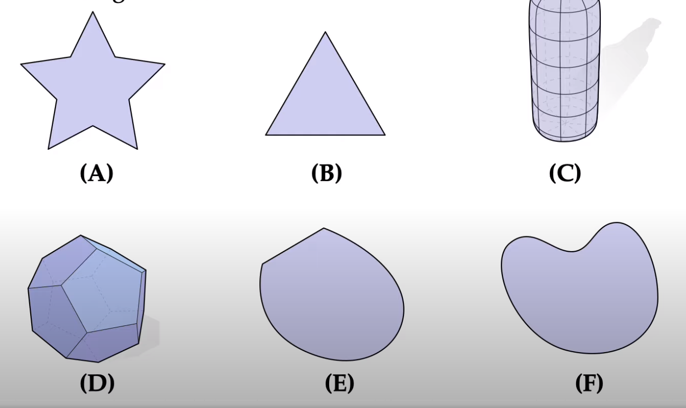

based on [this lecture](https://youtu.be/TDic3pJyYb8)

# Overview
- Today: What is a mesh?  
- We will study mathematical objects called *Simplicial Complexes*.  
- We will consider Abstract vs Geometric simplicial complexes
- Application: topological data analysis 
- Cell complexes 
- Poincare dual and discrete exterior calculus 
- Data Structures

# Connection to Differential Geometry 
Object we are modeling is called a *Topological Space*. Loosely speaking, this specifies how points connect without specifying *where* they are located.

# Convex Sets 
Which of the following sets are convex?

**Definition**: A subset $S\subset \mathbb{R}^n$ is called *convex* if for every pair of points $p, q\in S$, the line segment between $p$ and $q$ is contained in $S$.  

Thus, $B$, $D$, and $E$ are convex. The rest are not.  

## Convex Hull 
**Definition**: For any subset $S\subset\mathbb{R}^n$, its convex hull, $\text{conv}(S)$ is the smallest convex set containing $S$, or equivalently, the intersection of all convex sets containing $S$.

