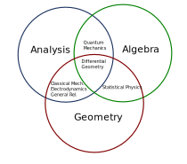

based on [this lecture](https://youtu.be/V49i_LM8B0E)

# Introduction 

**AIM**: Provide a proper mathematical language (re: framework) for 
- classical mechanics 
- electromagnetism 
- quantum mechanics 
- statistical physics 

Math we have used so far: 
- Analysis (everything) 
- Algebra  (quantum mechanics)
- Geometry (classical mechanics, EM, stat-mech)

The hierarchy of mathematical structure: 
1. *Logic*: the rules of the game
2. *Set Theory*: how to define mathematical objects & collections
3. *Topology*: how to define notions of continuity of maps 
4. *Topological Manifolds*: Topological spaces that locally look like $\mathbb{R}^d$.
5. *Differentiable Manifold*: how to define a notion of *derivative*
6. *Bundles*: to enable us to marry useful manifolds together
7. *Geometry*: to provide rigorous frameworks for vector/tensor fields. Ex: symplectic and metric geometry.
8. **Physics**: this is where we want to end up

# 1. Axiomatic Set Theory

## 1.1 Propositional Logic
**Def**: A proposition $p$ is a variable (whatever that means) that can take the values of "true" or "false" but no other.  

We can build new propositions from given ones with the help of logical operators. 
1. Unary operators

| $p$ | $\neg p$ | $id$ | $T_p$ | $\perp_p$ |
| ---| ---| --- | --- | --- |
| t | f | t | t | f | 
| f | t | f | t | f |

2. Binary Operators
| $p, q$ | $p\wedge q$ | $p \vee q$ | $p \not\vee q$ | $p \Rightarrow q$ | $p \Leftrightarrow q$ |
| --- | --- | --- | --- | --- | --- |
| t, t | t | t | f | t | t |
| t, f | f | t | t | f | f |
| f, t | f | t | t | t | f |
| f, f | f | t | f | t | t |

The binary operator $\Rightarrow$ is called *implication*. One will not the interesting fact that if we start with *false* we can get *anything*. This is called **ex falso quodlibet**  

**Theorem**: $(p\Rightarrow q)\Leftrightarrow (\neg q \Rightarrow \neg p )$  
**Corollary**: we can prove assertions by way of *contradiction*.  

(*proof***: by table

| p, q | $\neg p$, $\neg q$ | $p \Rightarrow q$ | $\neg q \Rightarrow \neg p$ |
| --- | --- | --- | --- | 
| t, t | f, f | t | t |
| t, f | f, t | f | f |
| f, f | t, t | t | t |
| f, t | t, f | t | t |

**Remark 1** We agree on decreasing binding strength in the sequence
\begin{equation}
    \neg, \wedge, \vee, \Rightarrow, \Leftrightarrow
\end{equation}

**Remark 2** All higher order operators, e.g. $\Diamond$(p_1, ..., p_n)$, can be constructed from one single binary operator, the so called *nand* operator: 

| p, q | $p \uparrow q $ |
| --- | --- | 
| t, t | f | 
| t, f | t |
| f, t | t | 
| f, f | t |

## 1.2 Predicate Logic

**Def** A predicate is a proposition-valued function of some variable(s).  

ex: $P(x)$ is true or false dependent on $x$. Right now we don't have any restriction on what $x$ is (we don't have sets yet).  

We can again construct new predicates from old ones. 
1. $Q(x,y,z) :\Leftrightarrow P(x) \wedge R(y, z)$
2. convert predicate, $P$, of one variable into a proposition: 
\begin{equation}
    \boxed{\forall x: \; P(x)}
\end{equation}
which we read as "for all $x$, $P(x)$ is *true*". This is defined to be true if $P(x)$ is true **independent of $x$**  

*Feel good example*: $P(x):\Leftrightarrow $ "x is a human being" $\Rightarrow$ "x has been created", then $\forall x: \; P(x)$ is true.  

**Def**: Existence quantification: 
\begin{equation}
\boxed{\exists x: \; P(x)}
\end{equation}
is defined such that $\exists x: \; P(x) \Leftrightarrow \neg\left(\forall x: \neg P(x)\right)$

**Corollary**: $\forall x: \neg P(x) \Leftrightarrow \neg\left( \exists x: P(x) \right)$  

**Remark 1**: Quantification for predicates of more than one variable 
\begin{equation}
Q(y) :\Leftrightarrow \forall x: P(x,y)
\end{equation}

**Remark 2**: The order of quantification matters: 
\begin{equation}
    \forall x: \exists y: P(x, y) 
\end{equation}
is generically different from 
\begin{equation}
    \exists y: \forall x: P(x, y)
\end{equation}

## 1.3 Axiomatic Systems & Theory of Proofs
What actually is a proof? How do you argue? What are the valid rules of writing down a proof?  

This can actually be defined...  

**Def**: An *axiomatic system* is a finite sequence of propositions $a_1, a_2, ... , a_N$ called *the axioms*.

**Def**: A *proof* of a proposition, $p$, within an axiomatic system $a_1,...,a_N$ is a *finite* sequence of propositions, $q_1,...,q_M\Leftrightarrow p$ such that for any $1 \leq j \leq M$ either 
1. $q_j$ is a proposition from the list of axioms $a_1, ..., a_N$. 
2. $q_j$ is a *tautology* (a proposition that is always true, e.g. $p\vee \neg p$)
3. $q_j$ ("Modus ponens") $\exists\; 1\leq m,n < j: q_m\wedge q_n \Rightarrow q_j$ is true  

**Remark**: This definition allows you to easily recognize a proof (i.e. you could in principle give it to a computer). An altogether *different* matter is to *find* a proof.

**Remark**: Obviously, any tautology, should it occur in the axioms, can be removed from the list of axioms without impairing the power of the axiomatic system.  

An extreme case of this is: the axiomatic system for propositional logic $\rightarrow$ the empty sequence (because all we can prove are tautologies).  

**Def**: An axiomatic system is *consistent* if there exists a proposition $q$ which cannot be proven from the axioms: $\neg\left(a_1,...,a_n\right) \vdash q$  

Idea behind the definition: consider an axiomatic system containing contradictory propositions. For instance $..., s , ... , \neg s, ...$. Then by deduction rule 3, 
\begin{equation}
    s \wedge \neg s \Rightarrow q
\end{equation}
is tautologically true.  

**Theorem**: Propositional logic is consistent.  
**(pf)**: it suffices to show that there exists a proposition that can not be proven within propositional logic. Propositional logic has an empty sequence of axioms. Therefore only rules 2 and 3 may carry a proof. Only tautologies can be proven: $q \wedge \neg q$ can not be proven (it's always false).  

**Theorem**: (Gödel) Any axiomatic system powerful enough to encode the elementary arithmetic of natural numbers $\mathbb{N}$ is either inconsistent or contains a proposition that can neither be proved nor disproved... This sent shockwaves through the mathematics world since this was the one place where the notion of *truth* was clear (i.e. if it can be proven).  

**(pf)** basic idea: Assign to each mathematical or meta-mathematical statement a number, now called the Gödel-number, i.e. 
\begin{equation}
    a^2 + b^2 = c^2 
\end{equation}
can be assigned one number. Then we use a "barber shaves all who can not shave themself" type reflexive logic to arrive at a contradictory statement.
