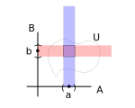

based on [this lecture](https://youtu.be/1wyOoLUjUeI)

# 2. Topological Spaces
Start looking at topological spaces. Topological spaces present us the weakest structure on a set that provides notions of convergence and continuity of maps. 

**Def**: Let $M$ be some set. Then a choice $\mathcal{O}\subseteq\mathcal{P}(M)$ is called a **topology** on $M$ if:
1. $\emptyset \in \mathcal{O}$ and $M\in\mathcal{O}$
2. $U,V\in\mathcal{O}$ $\Rightarrow$ $\bigcap \{U, V\}\in\mathcal{O}$.
3. $C\subseteq \mathcal{O} \Rightarrow \bigcup C \in \mathcal{O}$

**Terminology**: the pair $(M, \mathcal{O})$ is called a *Topological Space*. Elements $o\in\mathcal{O}$ are called *open sets*.

**Remark**: Unless $|M|=1$, there are different topologies $\mathcal{O}$ one can choose on the same set $M$.

| $|M|$ | # of topologies | 
| --- | --- | 
| 1 | 1 | 
| 2 | 4 | 
| 3 | 29 | 
| 4 | 355 | 
| 5 | 6942 | 
| 6 | 29527 | 
| 7 | 9535241 | 

Examples 
1. Let $M$ be any set. Then $\mathcal{O} = \{\emptyset, M\}$ is a topology called the "chaotic" topology.
2. Let $M$ be any set. Then $\mathcal{O}=\mathcal{P}(M)$ is a topology called the "discrete" topology.
3. Let $M=\{1, 2, 3\}$; $\mathcal{O}=\{\emptyset, \{1\}, \{2\}, \{1, 2, 3\} \}$ is a topology
4. Important and heavily used example: $M=\mathbb{R}^d := \mathbb{R}\times ... \times \mathbb{R}$ d-times. We define $\forall x \in \mathbb{R}^d$ and $\forall r > 0$, 
\begin{equation}
    B_r(x) := \left\{ y\in\mathbb{R}^d \; \middle\vert \; \| x-y\|_2 := \sqrt{\sum_{i=1}^d(y^i-x^i)^2} < r\right\}
\end{equation}
called the *open ball* of radius $r$ around $x\in\mathbb{R}^d$. We say that
\begin{equation}
    U\in\mathcal{O} :\Leftrightarrow \forall p\in U: \exists r>0: B_r(p)\subseteq U
\end{equation}
Graphically, this looks like:

## 2.2 Construction of new Topologies 
**Def**: Let $(M,\mathcal{O})$ be a topological space. Let $N\subset M$. Then the following object
\begin{equation}
    \mathcal{O}\big\vert_{N} := \{U\cap N \; | \; u\in \mathcal{O}\}
\end{equation}
is a topology on $N$ called the **induced** topology

**Def**: Consider $(A, \mathcal{O}_A)$, and $(B, \mathcal{O}_B)$ topological spaces. Equip $A\times B$ with the so-called *product topology*
\begin{equation}
    \mathcal{O}_{A\times B}
\end{equation}
define implicitly by 
\begin{equation}
    U \in \mathcal{O}_{A\times B} :\Leftrightarrow \forall p=(a,b)\in U: \exists S\in\mathcal{O}_A, T\in\mathcal{O}_B: S\times T \in U
\end{equation}
Intuitively, 

**Remark**: 
1. We can do this for any finite $A_1\times A_2\times ... \times A_N$. 
2. $\mathcal{O}_{\text{standard } \mathbb{R}^d}  = \mathcal{O}_{\mathbb{R}\times\mathbb{R}\times ... \times \mathbb{R}}$ could be a suitable definition if we only wanted to define the standard topology on the real number line.

## 2.3 Convergence

**Def**: A sequence q (i.e. a map $q:\mathbb{N}\to M$ on a top space $(M, \mathcal{O})$) is said to converge against a point $a\in M$ if for every open neighborhood around $a$, i.e.
\begin{equation}
    \forall U\in\mathcal{O}: a\in U
\end{equation}
it follows that 
\begin{equation}
    \exists N \in \mathbb{N}
\end{equation}
such that
\begin{equation}
    \forall n \geq N: q(n) \in U
\end{equation}

*examples* 
1. Let $(M, \{\emptyset, M\})$. Then, let 
\begin{equation}
    q:\mathbb{N}\to M
\end{equation}
be some sequence. **Claim**: Any sequence converges against every point in $M$. 

2. $(M, \mathcal{P}(M))$, then only all almost constant sequences converge.
3. $(\mathbb{R}^d, \mathcal{O}_{st})$, then we have the theorem that $q$ converges against $a\in\mathbb{R}^d$ if $\forall \epsilon > 0:$ $\exists N\in \mathbb{N}:$ $\forall n > N$, $\lVert q(n)-a \rVert < \epsilon $.

## 2.4 Continuity
**Def**: Let $(M, \mathcal{O}_M)$, $(N, \mathcal{O}_N)$ be topological spaces. Let $\phi:M\to N$ be a map. Then $\phi$ is called **continuous** if 
\begin{equation}
    \forall V \in \mathcal{O}_N: \text{preim}_{\phi}(V) \in \mathcal{O}_M
\end{equation}
In other words, for continuous functions, the preimages of open sets are open.

*examples*
1. $\phi:M\to N$ such that $(M, \mathcal{O}(M))$, $(N, \mathcal{O}_N)$. Claim: any map $\phi$ is continuous between these two topological spaces.
2. $\phi:M\to N$ such that $(M, \mathcal{O}_M)$, $(N, \{\phi, N\})$. Claim: any map is continuous
3. $\phi:\mathbb{R}^d\to \mathbb{R}^f$ such that both use the standard topology. Then we recover the standard definition using $\epsilon$-$\delta$.

**Def**: Let $\phi:M\to N$ be a bijection. Now equipping $(M, \mathcal{O}_M)$, and $(N, \mathcal{O}_N)$, we call $\phi$ a **homeomorphism** if 
1. $\phi:M\to N$ is continuous
2. $\phi^{-1}:N \to M$ exists and is continuous

**Remark**: Homeo(morphism)s are the *structure-preserving maps* in Topology.

**Def**: If there exists a homeomorphism $\phi:M\to N$, then $\phi$ provides a one-to-one pairing of the open sets of $M$ with those of $N$. We then write, $(M,\mathcal{O}_M)\cong_{_\text{top}} (N, \mathcal{O}_N)$ which translates to "isomorphic as topological spaces" or **homeomorphic**.  

**Note**: This implies that the underlying sets are isomorphic at the level of sets, i.e. $M\cong_{\text{set}}N$.

